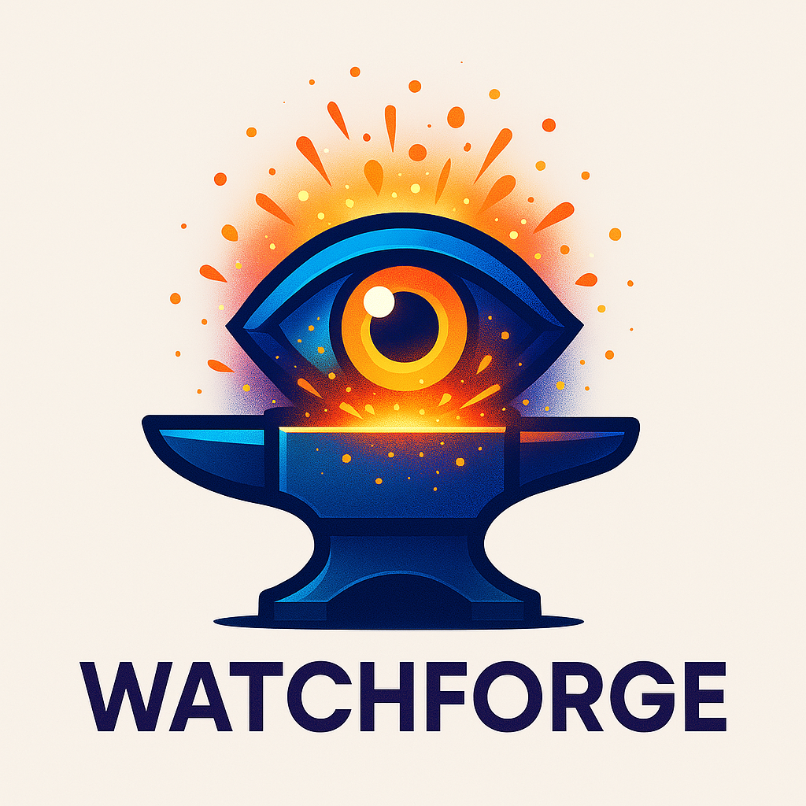

<p align="left">
  
</p>

# WatchForge

WatchForge is a self-hosted, AI-powered video processing system built in Go. It detects people, animals, and insects in video feeds using YOLOv4-tiny and GoCV, and provides a cross-platform user interface via Fyne for mobile and desktop access.

## 🚀 Project Overview

WatchForge enables intelligent surveillance by processing video files or streams, detecting motion and objects of interest, and serving annotated results through a Go-based server. It is designed to run on resource-constrained devices like mini PCs and supports modular development with future extensibility in mind.

## ✨ Features

- 🎥 Video processing using GoCV (OpenCV bindings for Go)
- 🧠 AI detection with YOLOv4-tiny (ONNX format)
- 📦 Self-hosted Go server with REST API
- 🔒 User management with PostgreSQL + GORM
- 📱 Native UI for Android, Linux, Windows (via Fyne)
- 📤 Serve processed videos to mobile/desktop clients
- 🔄 Modular architecture for future model upgrades

## 🛠️ Tech Stack

- **Language**: Go
- **UI**: Fyne (mobile + desktop)
- **AI**: YOLOv4-tiny (ONNX) + OpenCV DNN via GoCV
- **Database**: PostgreSQL
- **ORM**: GORM
- **Video I/O**: GoCV (FFmpeg-enabled OpenCV)
- **Server**: Go HTTP server (net/http or Gin)

## 👨‍💻 Getting Started

### Prerequisites

- Go 1.20+
- OpenCV with FFmpeg support
- GoCV (`gocv.io/x/gocv`)
- PostgreSQL (local or Docker)
- Git

### Clone the Repository

```bash
git clone https://github.com/yourusername/watchforge.git
cd watchforge
