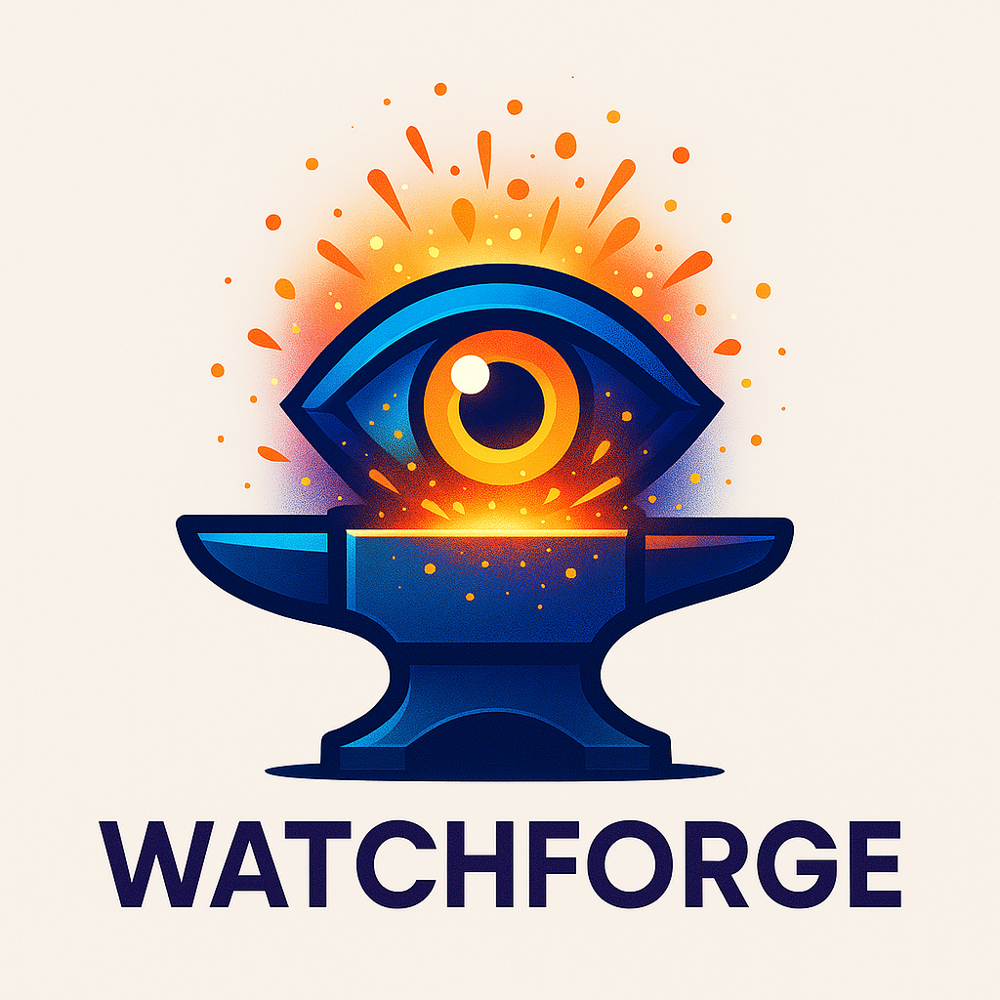

<p align="left">
  
</p>

# WatchForge

WatchForge is a self-hosted video processing for NVR (Network Video Recorder) system to enhance pixel precision motion detection.

##  Project Structure

```
watchforge/
├── WatchForge.slnx              # Main .NET solution file
├── testapps/                    # Test applications
│   └── nvr-client/              # .NET NVR Client for ONVIF devices
│       └── src/
│           ├── WatchForge.NVR.Client.Core/
│           ├── WatchForge.NVR.Client.Core.Tests/
│           └── WatchForge.NVR.Client.TestApp/
├── client/                      # Frontend client application
├── db/
│   └── queries/                 # Database schema and queries
└── server/                      # Dotnet-based server components
    └── MotionSentinel/          # Linux Worker Service — OpenCV motion detection
        ├── WatchForge.MotionSentinel.Server.Core/
        ├── WatchForge.MotionSentinel.Server.Core.Tests/
        ├── WatchForge.MotionSentinel.Server.Service/
        └── WatchForge.MotionSentinel.Server.Service.Tests/
```

## ✨ Features

### MotionSentinel (.NET · Linux)
- 🎯 Farneback Dense Optical Flow — per-frame motion region detection using OpenCV
- 📁 Local filesystem — watches NVR recordings folder, writes JSON detection results
- ⚡ FileSystemWatcher + backfill — picks up files written while the service was down
- 🔌 Headless Worker Service — runs as a systemd unit, no UI required
- 🧪 test coverage via TUnit + Moq

See [server/MotionSentinel/README.md](server/MotionSentinel/README.md) for full docs.

### NVR Client (.NET· Linux)
- 📹 ONVIF Client - Full ONVIF protocol support
- 🔧 SharpOnvif - Uses actively maintained SharpOnvif library
- 🖥️ .NET 10 supported Linux (x64)
- 🧪 test coverage via TUnit + Moq
See [testapps/nvr-client/README.md](testapps/nvr-client/README.md) for full docs.

## 🛠️ Tech Stack

### .NET Components
- **Framework**: .NET 10
- **ONVIF**: SharpOnvif library
- **Motion detection**: OpenCV (Farneback optical flow) via OpenCvSharp4
- **Platform**: Linux (x64);
- **Testing**: TUnit + Moq with code coverage

## 👨‍💻 Getting Started

### Prerequisites

#### For .NET Components
- .NET 10 SDK
- Any .NET 10 runtime platform (Linux x64)

### Clone the Repository

```bash
git clone https://github.com/StipecMV/watchforge
cd watchforge
```

## �📝 License

WatchForge is an open-source project. See the [LICENSE](LICENSE) file for details.
