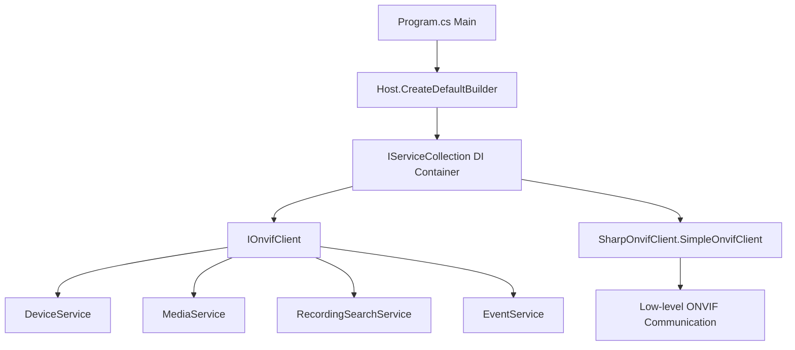

<p align="left">
  
</p>

# WatchForge

WatchForge is a self-hosted video processing for NVR (Network Video Recorder) system to enhance pixel precision motion detection.

##  Project Structure

```
watchforge/
├── WatchForge.slnx              # Main .NET solution file
├── testapps/                    # Test applications
│   └── nvr-client/              # .NET NVR Client for ONVIF devices
│       ├── src/
│       │   ├── WatchForge.NVR.Client.Core/
│       │   └── WatchForge.NVR.Client.TestApp/
│       └── tests/
│           └── WatchForge.NVR.Client.TestApp.Tests/
├── client/                      # Frontend client application
├── db/
│   └── queries/                 # Database schema and queries
└── server/                      # Dotnet-based server components
```

## ✨ Features

### NVR Client (.NET)
- 📹 ONVIF Client - Full ONVIF protocol support
- 🔧 SharpOnvif - Uses actively maintained SharpOnvif library
- 🏗️ SOLID Architecture - Clean code with dependency injection
- 🖥️ Cross-platform - Windows, macOS, Linux (x64, ARM64)
- ✅ 100% Test Coverage - Comprehensive unit tests with NUnit + TUnit

## 🛠️ Tech Stack

### .NET Components
- **Framework**: .NET 10
- **ONVIF**: SharpOnvif library
- **Platform**: Windows, macOS, Linux (x64, ARM64)
- **Testing**: NUnit + TUnit with code coverage

## 👨‍💻 Getting Started

### Prerequisites

#### For .NET Components
- .NET 10 SDK
- Linux ARM64 (Raspberry Pi) or Linux x64 (desktop)

### Clone the Repository

```bash
git clone https://github.com/StipecMV/watchforge
cd watchforge
```

### NVR Client Quick Start

See [testapps/nvr-client/README.md](testapps/nvr-client/README.md) for detailed instructions.

```bash
cd testapps/nvr-client

# Build for current platform
dotnet build

# Run the test application
dotnet run --project src/WatchForge.NVR.Client.TestApp

# Run tests
dotnet test
```

### Build for Raspberry Pi

```bash
cd testapps/nvr-client

# Publish for ARM64
dotnet publish -c Release -r linux-arm64 --self-contained
```

## 📊 Architecture

### NVR Client Architecture


```mermaid
graph TD
    A[Program.cs Main] --> B[Host.CreateDefaultBuilder]
    B --> C[IServiceCollection DI Container]
    C --> D[IOnvifClient]
    D --> E[DeviceService]
    D --> F[MediaService]
    D --> G[RecordingSearchService]
    D --> H[EventService]
    C --> I[SharpOnvifClient.SimpleOnvifClient]
    I --> J[Low-level ONVIF Communication]
```

## 🧪 Testing

```bash
# Run NVR Client tests
cd testapps/nvr-client
dotnet test

# Run with code coverage
dotnet test /p:CollectCoverage=true

# Run with 100% threshold
dotnet test /p:CollectCoverage=true /p:Threshold=100
```

## 🔌 Environment Variables

NVR Client configuration can be overridden using environment variables:

```bash
export Onvif__Host=192.168.68.58
export Onvif__Port=8080
export Onvif__Username=your_username
export Onvif__Password=your_password
```

## 🏗️ SOLID Principles

The NVR Client project implements SOLID principles:

| Principle | Implementation |
|-----------|----------------|
| **S** - Single Responsibility | Each service has one responsibility |
| **O** - Open/Closed | Extension via new interface implementations |
| **L** - Liskov Substitution | All services implement their interfaces |
| **I** - Interface Segregation | Multiple small, focused interfaces |
| **D** - Dependency Inversion | Dependency injection via IServiceCollection |

## 📝 License

WatchForge is an open-source project. See the LICENSE file for details.
