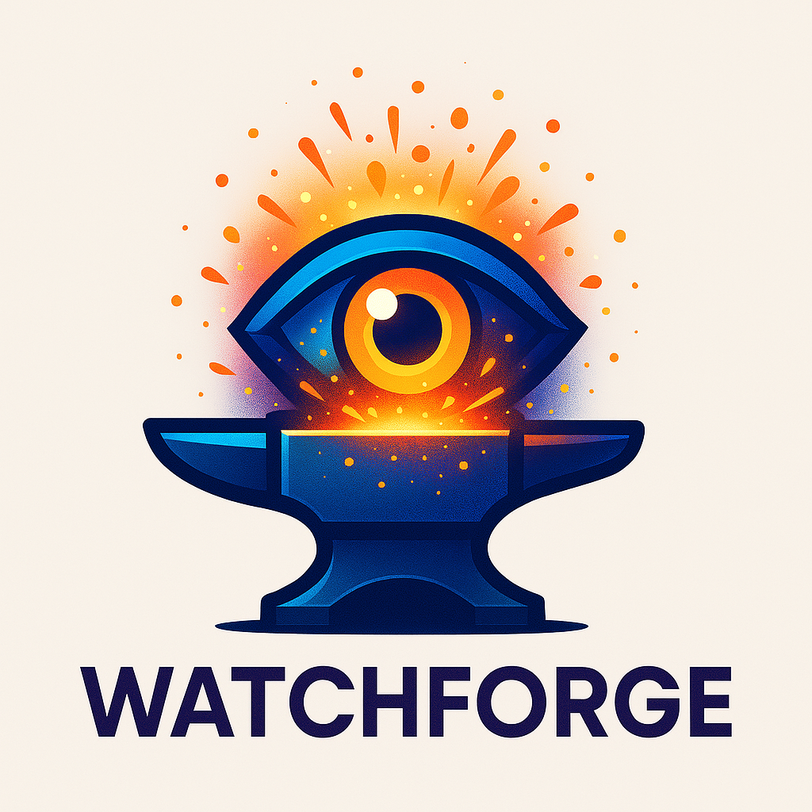

<p align="left">
  
</p>

# WatchForge


WatchForge je self-hosted video processing pre NVR (Network Video Recorder) systém — vylepšuje pixel-precision detekciu pohybu nad Movols/Xiongmai NVR (DVRIP protokol). Deteguje pohyb, osoby a objekty, generuje klipy a fotky s obdĺžnikmi detekcie, doručuje cez REST API, MCP server a web UI.

## 🏗️ Architektúra (4 kontajnery)

```
┌─────────────────────────────────────────────────────────────┐
│  lokálny host (rootless Podman)                            │
│  ┌──────────────┐  ┌──────────────┐  ┌──────────────────┐   │
│  │ Runner       │  │ Api          │  │ Web UI (nginx)   │   │
│  │ DVRIP + OpenCV│  │ REST /api/v1 │  │ Angular SPA      │   │
│  │ job orchestr.│  │ session auth │  │ proxy /api → api │   │
│  └──────┬───────┘  └──────┬───────┘  └──────────────────┘   │
│         │  SQLite (WAL)   │                                   │
│         └──────┬──────────┘                                   │
│         watchforge-data volume                                │
│  ┌──────────────┐                                            │
│  │ MCP server   │ ← Hermes agent (search_motion, get_clip…)  │
│  └──────────────┘                                            │
│  NVR <nvr-ip>:34567 (DVRIP) ← Runner                     │
└─────────────────────────────────────────────────────────────┘
```

- **Runner** — worker loop (jobs: sync, download, analyze, clip_extract, purge), DVRIP klient, OpenCV motion (Farneback) + person detection (HOG+SVM), CPU fallback; interné HTTP `/internal/*`.
- **Api** — ASP.NET Core MVC, `/api/v1/*` (auth: session cookie + `X-Api-Token`), RFC 9457 ProblemDetails, CORS pre web UI.
- **Web UI** — Angular (SK/EN), login, dashboard (event-first), settings, focus zones, flag screen, témy.
- **MCP** — streamable HTTP server mapujúci REST API (search_motion, get_clip, trigger_processing, get_request_status, search_recordings).

Detaily: [docs/architecture.md](docs/architecture.md), požiadavky: [docs/requirements.md](docs/requirements.md), stav: [docs/kanban.md](docs/kanban.md).

## 📁 Projektová štruktúra

```
watchforge/
├── WatchForge.slnx                  # .NET 10 solution
├── Directory.Packages.props         # CPM — centralizované NuGet verzie
├── libraries/
│   ├── WatchForge.DVRIP.Library/        # DVRIP protokol (login, file query, download)
│   ├── WatchForge.MotionSentinel.Library/# OpenCV detekcia: optical flow, HOG person, CUDA fallback
│   ├── WatchForge.Processing.Library/   # SQLite repo (WAL), job orchestration, retention
│   ├── WatchForge.Interfaces.Library/   # entity, state machine, repo rozhrania
│   └── WatchForge.Contracts.Library/    # zdieľané DTO (camelCase)
├── applications/
│   ├── services/WatchForge.Runner/      # kontajner 1 — worker service
│   ├── server/WatchForge.Api/           # kontajner 2 — REST API
│   ├── web/WatchForge.UI/               # kontajner 3 — Angular (Bun toolchain)
│   └── tools/WatchForge.Mcp/            # kontajner 4 — MCP server
│       WatchForge.FakeNvr.Host/         # fake NVR pre E2E (deploy)
├── tests/                               # TUnit + Moq (DVRIP, Processing, Runner, Api, Mcp, UI vitest)
├── deploy/
│   ├── Dockerfile.{runner,api,mcp,ui,fake-nvr}
│   ├── compose.yaml                      # produkčný stack (4 kontajnery + secrets)
│   ├── compose.e2e.yaml                  # E2E variant s fake NVR
│   ├── quadlet/                          # systemd units (4 .container + .network + backup timer)
│   ├── scripts/                          # entrypoint-runner.sh, backup-db.py, e2e.sh
│   └── secrets/                          # GITIGNORED — NVR prihlasovacie údaje
└── docs/                                 # architecture, requirements, kanban, benchmarky, hw-inventory
```

## ✨ Funkcie

- **Live view kamier** — 8 kamier v režimoch 1/8 (dvojklik prepína), stream cez DVRIP OPMonitor → ffmpeg → LiveFrameCache (JPEG polling/MJPEG, fps podľa siete), uvoľnenie streamu ~30 s po odchode diváka; **verejné bez prihlásenia** (S22c).
- **Detekcia pohybu** — Farneback dense optical flow na 1080p downscale (S22g: 720p + 1 fps pre vyššiu rýchlosť), regióny normalizované 0..1 (platné pre 4K), CPU fallback (produkcia CPU-only).
- **Person/object detekcia** — HOG + SVM (klasická CV, nie ML model), reťazená za motion (FR-04).
- **Face recognition** — YuNet + SFace (OpenCV DNN, 128-dim embedding, cosine threshold 0.36), identity API + UI (S10/S17).
- **Analýzy/detekcie** — event-first dashboard s timeline, filter chipy, TODAY stat; verejné.
- **Job orchestration** — SQLite front, priority (WhatsApp > Telegram > Web UI > system > background), semafory 4+4, preempcia (FR-08), recovery po reštarte, retry.
- **REST API** — kamery, recordings, detections, requests (stav + odhad), clips (video + fotka s obdĺžnikom), live (frame/stream/release/zone-background), exports, persist/flag/annotations, profiles (verziované), identities, users, system (health/status/info).
- **MCP server** — pre agentov (Hermes): „hľadaj pohyb 14:00–16:00" → fotka s obdĺžnikom; beží ako systemd služba `watchforge-mcp` (127.0.0.1:8770).
- **Web UI** — Angular, SK/EN, témy (Light+Green / Dark+Purple / Contrast+Orange), PWA (manifest + SW), admin login cez `#/admin`, settings admin-only.
- **Retention & backup** — purge job (1×/hod, 30 dní), SQLite backup (VACUUM INTO + WAL checkpoint, denný timer 04:00, 14 dní rotácia).

## 🛠️ Tech Stack

- **.NET 10**, ASP.NET Core, TUnit + Moq, OpenCvSharp4 (+ OpenCvSharp4.Cuda voliteľne), Microsoft.Data.Sqlite (WAL), ModelContextProtocol
- **Angular 19 + Bun** (vitest), nginx
- **Podman 4.x** (rootless) + Quadlet/systemd

## 🚀 Deployment

Kompletný návod: [deploy/README.md](deploy/README.md) — compose, Quadlet units, secrets, backup, E2E, runbook.

> **Produkcia (2026-08-12+) beží na lokálny host ako systemd user služby** —
> `watchforge-api.service` (:5000), `watchforge-runner.service` (:8081),
> `watchforge-web.service` (:4200, python static server), `watchforge-mcp.service` (:8770).
> Prístup cez **Tailscale serve** `https://<host>.<tailnet>.ts.net:<port>`.
> Dockerfile/compose/Quadlet zostávajú ako build variant a pre E2E s fake NVR.

### Rýchly štart (compose)

```bash
# 1. Postaviť image (CPU build — CUDA .so vyžaduje libcuda runtime, M2200 nepodporuje sm_100)
podman build -t watchforge-runner:latest -f deploy/Dockerfile.runner .
podman build -t watchforge-api:latest    -f deploy/Dockerfile.api .
podman build -t watchforge-ui:latest     -f deploy/Dockerfile.ui .
podman build -t watchforge-mcp:latest    -f deploy/Dockerfile.mcp .

# 2. Secret s NVR prihlasovacími údajmi (deploy/secrets/nvr-auth.yaml je gitignored)
podman secret create nvr-auth deploy/secrets/nvr-auth.yaml

# 3. Spustiť stack
podman-compose -f deploy/compose.yaml up -d   # alebo Quadlet: pozri deploy/README.md
```

### E2E (bez reálneho NVR)

```bash
bash deploy/scripts/e2e.sh
# → E2E PASS: request completed, video + fotka doručené (fotka = frame s obdĺžnikom detekcie)
```

## 🧪 Testy

```bash
# .NET (TUnit — použi dotnet run --project, nie dotnet test)
for p in tests/libraries/WatchForge.Processing.Library.Tests \
         tests/services/WatchForge.Runner.Tests \
         tests/libraries/WatchForge.DVRIP.Library.Tests \
         tests/libraries/WatchForge.MotionSentinel.Library.Tests \
         tests/applications/server/WatchForge.Api.Tests \
         tests/tools/WatchForge.Mcp.Tests; do
  dotnet run --project $p
done

# Web UI
cd applications/web/WatchForge.UI && bun run test
```

Stav (2026-08-15): **325 .NET testov + 189 UI testov + 15 E2E (Playwright)** —
DVRIP 83, Processing 49, Interfaces 6, Contracts 5, MotionSentinel 41, Runner 55, Api 80, Mcp 6, UI 189, E2E 15. Release build 0 Warning / 0 Error.

## 📝 Licencia

Open-source projekt. Viď [LICENSE](LICENSE).
