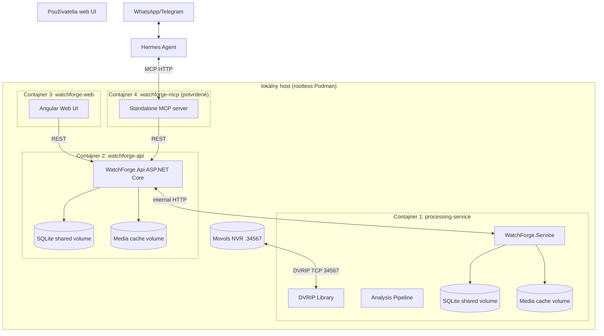
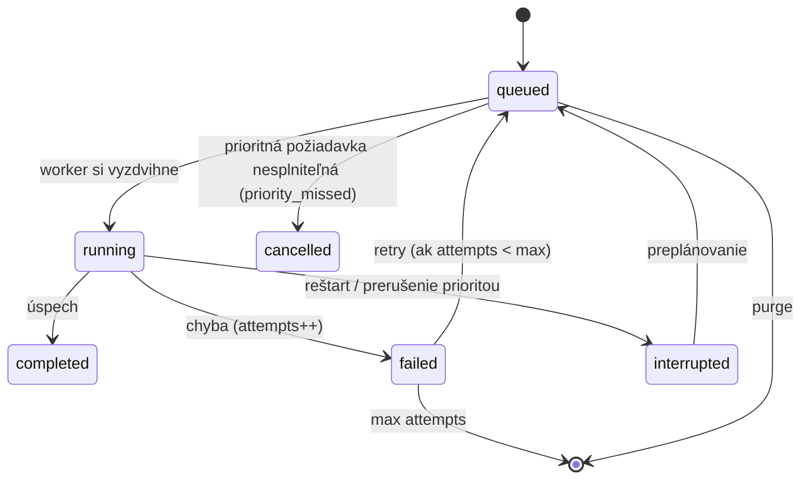
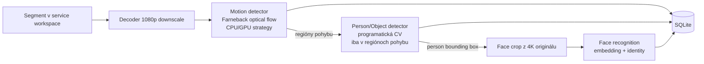

# WatchForge — Architecture & Data Model

> Status: architektonický návrh vychádzajúci z `docs/requirements.md` (FR-01..FR-15, NFR-01..NFR-08).
> Cieľ: definovať komponenty, vrstvy, dátový model, pipeline, kontrakty a testovaciu stratégiu pred implementáciou.

## 1. Architektonické princípy

| Princíp | Aplikácia vo WatchForge |
|---|---|
| **SOLID** | Každá trieda má jednu zodpovednosť; závislosti idú cez abstrakcie (DIP); detektory sú vymeniteľné cez interface (OCP); rozhrania sú úzke (ISP); backendy dodržiavajú kontrakt (LSP). |
| **KISS** | Žiadne zbytočné vrstvy/abstrakcie; najjednoduchšie riešenie, ktoré spĺňa požiadavky. Job orchestration cez SQLite tabuľku (nie message broker). |
| **DRY** | Zdieľané DTO/kontrakty v jednej knižnici; centralizované verzie balíkov (`Directory.Packages.props`); opakovaná orchestrácia cez spoločné služby. |
| **YAGNI** | Multi-site funkcionalita sa neimplementuje — len `nvr_id`/`site_id` stĺpce. Face recognition vrstva sa stavuje až keď na ňu príde kanban úloha. |
| **MVC** | API: ASP.NET Core MVC (Controllers/Models/Views-nie — JSON). Web: Angular komponenty (MVVM štýl). Service: vrstvená štruktúra (domain/infrastructure/host). |
| **DI** | Composition root v každom hoste; konkrétne služby sa skladajú len na jednom mieste. |
| **Repository** | Prístup k SQLite cez repository rozhrania (recording, detection, job, config, user). |
| **Factory** | Detector factory (CPU/GPU backend), backend factory (rovnaký vzor ako yay_see_sharp). |
| **Strategy** | Compute backend (CPU vs GPU) je strategy; person detection stratégia je vymeniteľná. |
| **Pipeline / Chain** | Detekčné vrstvy motion → person → face sa reťazia cez orchestrátor (analogicky k existujúcemu `MotionAnalysisOrchestrator`). |
| **Options pattern** | Konfigurácia cez `IOptions<T>`; sekcie: Dvrip, Files, Detection, Jobs, Retention, Api. |
| **TDD** | Unit testy píšeme pred kódom (RED→GREEN→REFACTOR); integračné a E2E testy overujú reálne hranice. |

## 2. Vysokodrovňová architektúra (4 kontajnery)



**Poznámka k MCP**: MCP server beží ako **samostatný kontajner (4)** — potvrdené stakeholderom. Kontajner 4 mapuje REST API na MCP nástroje (HTTP transport pre Hermes `mcp_servers`). `/mcp` endpoint v API sa nepoužíva.

## 3. Riešenie .NET (projektová štruktúra)

```text
watchforge/
├── WatchForge.slnx
├── Directory.Packages.props                 # DRY: centralizované verzie NuGet (CPM)
├── libraries/
│   ├── WatchForge.DVRIP.Library/            # FR-02: DVRIP protokol (login, file query, download, live monitor)
│   ├── WatchForge.MotionSentinel.Library/   # FR-03..FR-06: detekčné abstrakcie + orchestrátor
│   ├── WatchForge.Processing.Library/       # FR-07,FR-08: SQLite repository, job orchestration, retention
│   ├── WatchForge.Interfaces.Library/       # entity modely, job state machine, repo rozhrania
│   └── WatchForge.Contracts.Library/        # FR-09: zdieľané DTO (camelCase)
├── applications/
│   ├── services/WatchForge.Runner/          # Kontajner 1: Worker Service host (DI composition root)
│   ├── server/WatchForge.Api/               # Kontajner 2: ASP.NET Core MVC (REST /api/v1)
│   ├── web/WatchForge.UI/                   # Kontajner 3: Angular 19 (Bun toolchain)
│   └── tools/
│       ├── WatchForge.Mcp/                  # Kontajner 4: MCP server (C# MCP SDK)
│       └── WatchForge.FakeNvr.Host/         # fake NVR pre E2E (deploy)
├── tests/
│   ├── libraries/WatchForge.DVRIP.Library.Tests/          # unit (TUnit+Moq)
│   ├── libraries/WatchForge.MotionSentinel.Library.Tests/ # unit
│   ├── libraries/WatchForge.Processing.Library.Tests/     # unit: job state machine, retention, repository
│   ├── libraries/WatchForge.Interfaces.Library.Tests/     # unit: state machine
│   ├── libraries/WatchForge.Contracts.Library.Tests/      # unit: DTO serializácia
│   ├── services/WatchForge.Runner.Tests/                  # unit: worker, job handlery
│   ├── applications/server/WatchForge.Api.Tests/          # unit + integračné (WebApplicationFactory)
│   └── tools/WatchForge.Mcp.Tests/                        # unit + integračné (tool call)
├── tools/                                # benchmark/nástroje (nvr-bench, real-bench, cpu-benchmark, e2e-seed)
└── deploy/
    ├── Dockerfile.{runner,api,mcp,ui,fake-nvr}
    ├── compose.yaml                        # 4 kontajnery, shared volumes
    ├── quadlet/*.container                 # systemd units (voliteľné)
    └── scripts/                            # entrypoint-runner.sh, backup-db.py, e2e.sh
```

**Vrstvená závislosť (DIP)**: `Runner → Processing.Library → (Contracts | Interfaces | DVRIP.Library)`; `Api → Processing.Library (read side) + Contracts`; detekčné abstrakcie (`IMotionDetector`, `IPersonDetector`, `IFaceRecognizer`, `IFrameSource`) sú v MotionSentinel.Library — platforma sa dodáva cez DI v hoste.

## 4. Dátový model (SQLite)

Jedna databáza, WAL mode. Všetky časy v UTC. Koordináty regiónov sú normalizované 0..1 relatívne k 4K framu (konzistentné s existujúcim JSON výstupom).

```mermaid
erDiagram
    NVRS ||--o{ CAMERAS : "obsahuje"
    NVRS ||--o{ RECORDINGS : "vlastní"
    CAMERAS ||--o{ RECORDINGS : "nahráva"
    RECORDINGS ||--o{ DETECTIONS : "má"
    DETECTIONS ||--o| FACES : "voliteľne"
    IDENTITIES ||--o{ FACES : "rozpoznáva"
    RECORDINGS ||--o{ PERSIST_FLAGS : "môže mať"
    CONFIG_VERSIONS ||--o{ RECORDINGS : "použitá pri analýze"
    CAMERAS ||--o{ CONFIG_VERSIONS : "konfiguruje"
    USERS ||--o{ PERSIST_FLAGS : "nastavil"
    JOBS ||--o| RECORDINGS : "spracúva"
    REQUESTS ||--o{ JOBS : "vytvára"
    REQUESTS ||--o{ CLIPS : "produkuje"

    NVRS {
        int nvr_id PK
        string site_id "single-site, pripravené na multi"
        string host
        int port
        string username
        string password_ref "odkaz na secret, nie plaintext v DB"
    }
    CAMERAS {
        int camera_id PK
        int nvr_id FK
        int channel "0-based NVR channel"
        string friendly_name "napr. Dvor (editovateľné v UI)"
        string icon_id "jeden z 40 location ikon (garden/parking/kitchen/...)"
        bool is_active
    }
    RECORDINGS {
        int recording_id PK
        int nvr_id FK
        int camera_id FK
        string source_type "segment | event_clip"
        string nvr_filename
        datetime begin_time
        datetime end_time
        int duration_sec
        int size_bytes
        string codec "hevc"
        int width
        int height
        string availability "available | unavailable | missed_during_outage"
        datetime unavailable_since
        datetime purge_at
        bool persisted
        int config_version_id FK
        string analysis_state "queued|downloading|analyzing|completed|failed|interrupted"
        datetime analysis_started_at
        datetime analysis_completed_at
        string error
        datetime created_at
        datetime updated_at
    }
    DETECTIONS {
        int detection_id PK
        int recording_id FK
        int camera_id FK
        string detection_type "motion | person | vehicle | animal | face"
        int timestamp_ms "od začiatku segmentu"
        int duration_ms
        float confidence
        string algorithm_version
        int config_version_id FK
        float region_x "0..1"
        float region_y
        float region_w
        float region_h
        float intensity "motion len"
        string object_class "person|car|animal|..."
        string flag "none | flagged | false_positive"
        int flagged_by FK "user, kto označil"
        datetime flagged_at
    }
    DETECTIONS ||--o{ ANNOTATIONS : "má užívateľské"
    USERS ||--o{ ANNOTATIONS : "kreslil"
    ANNOTATIONS {
        int annotation_id PK
        int detection_id FK
        int user_id FK
        float region_x "0..1"
        float region_y
        float region_w
        float region_h
        string label "text užívateľa"
        datetime created_at
    }
    FACES {
        int face_id PK
        int detection_id FK
        int identity_id FK "nullable = neznáma"
        blob embedding
        float confidence
        string temp_crop_path "4K crop, cleanup po spracovaní"
    }
    IDENTITIES {
        int identity_id PK
        string name
        int created_by FK
        datetime created_at
    }
    CONFIG_VERSIONS {
        int config_version_id PK
        int camera_id FK "NULL = zdieľaný profil"
        string profile_name "default | den | noc | shared"
        string profile_type "per_camera | shared"
        float sensitivity
        float intensity_threshold
        float min_contour_area
        text ignore_zones "JSON [{x,y,w,h,shape}] — IGNORE zóny (maska/exclusion)"
        text focus_zones "JSON [{x,y,w,h,shape}] — FOCUS zóny (focus región)"
        bool is_active
        datetime created_at
    }
    USERS {
        int user_id PK
        string username "fixný, unikátny (admin + rodinní používatelia)"
        string password_hash "PBKDF2/Argon2; prázdny reťazec = používateľ ešte nenastavil heslo"
        string role "admin | standard"
        int avatar_id "jeden z 10 avatar glyfov"
        string locale "sk | en"
        datetime created_at
    }
    PERSIST_FLAGS {
        int persist_id PK
        int recording_id FK
        int user_id FK
        string scope "recording | time_range"
        datetime range_start "time_range len"
        datetime range_end
        string note "napr. pre políciu"
        datetime created_at
        datetime removed_at "NULL = aktívne"
    }
    JOBS {
        int job_id PK
        int recording_id FK "NULL pre sync/other"
        int request_id FK "NULL pre background"
        string type "download | analyze | clip_extract | sync | purge"
        int priority "čím vyššie, tým skôr"
        string source "whatsapp|telegram|webui|background|system"
        string status "queued|running|interrupted|completed|failed|cancelled|priority_missed"
        text payload "JSON"
        int progress "0..100"
        int attempts
        string error
        datetime created_at
        datetime started_at
        datetime finished_at
    }
    REQUESTS {
        int request_id PK
        string source "whatsapp|telegram|webui|agent"
        string requester
        string query "pôvodná požiadavka"
        datetime from_time
        datetime to_time
        int camera_id "NULL = všetky"
        string detection_type_filter "NULL = motion"
        int context_before_sec "default 15"
        int context_after_sec "default 15"
        string status "queued|processing|completed|failed|priority_missed"
        string estimate "odhad času pre používateľa"
        datetime created_at
        datetime completed_at
    }
    CLIPS {
        int clip_id PK
        int request_id FK
        int recording_id FK
        datetime range_start
        datetime range_end
        string file_path "media cache volume"
        int size_bytes
        string kind "video | image"
        datetime created_at
        datetime expires_at "2-3h default"
    }
```



### Indexy

- `recordings (camera_id, begin_time)` — hlavný dotaz „kedy bolo čo".
- `recordings (nvr_filename)` UNIQUE — deduplikácia synchronizácie.
- `recordings (availability, purge_at)` — retention cleanup.
- `detections (camera_id, detection_type, timestamp_ms)` — query podľa typu a času.
- `detections (recording_id)` — načítanie všetkých detekcií segmentu.
- `detections (flag)` — flagged/false_positive filter (FR-16).
- `jobs (status, priority)` — výber ďalšieho jobu.
- `requests (created_at)`, `clips (expires_at)` — cleanup.

### Stavový model jobu



## 5. Detekčný pipeline



### Abstrakcie (`WatchForge.Analysis.Abstractions`)

```csharp
public interface IMotionDetector : IDisposable
{
    Task<IReadOnlyList<MotionRegion>> DetectAsync(VideoFrame frame, CancellationToken ct);
    void Reset(); // medzi segmentmi
}

public interface IPersonDetector : IDisposable
{
    Task<IReadOnlyList<DetectedObject>> DetectAsync(VideoFrame frame,
        IReadOnlyList<MotionRegion> motionRegions, CancellationToken ct);
}

public interface IFaceRecognizer : IDisposable
{
    Task<FaceMatch?> RecognizeAsync(Mat faceCrop4k, CancellationToken ct);
}

public interface IFrameSource : IDisposable
{
    int Width { get; }   // 4K pôvodné rozmery
    int Height { get; }
    Task<VideoFrame?> GetNextFrameAsync(int intervalMs, CancellationToken ct); // 1080p + 4K crop poziadavka
}

public interface IDetectionProfileResolver
{
    Task<DetectionProfile> ResolveAsync(int cameraId, DateTime segmentTime, CancellationToken ct);
}
```

**Koordinátové mapovanie** (FR-03): detekcia beží na 1080p; regióny sa prepočítavajú na 4K: `x4k = x1080p / 1920 * 3840`, normalizované na 0..1. Toto je čistá funkcia → unit testovateľná.

**Face vrstva (S17, 2026-08-09)**: namiesto pôvodného LBPH je produkčná implementácia **`OnnxFaceRecognizer`** — OpenCV DNN: **YuNet** (FaceDetectorYN, detekcia + 5 landmarkov + NMS) → affine align → **SFace 128-dim embedding** → cosine threshold 0.36 vs embeddings v DB (FACES). Modely YuNet 232 KB + SFace 38.7 MB (MIT, OpenCV Zoo) v Assets. Perzistencia = 128 float (512 B) BLOB (S10-2 vzor). LBPH ostáva v knižnici ako fallback; `IFaceRecognizer` interface umožňuje podsunúť iný model bez zmeny volajúceho.

**Compute backend (Strategy)**: `IDetectorFactory` vracia `IMotionDetector` implementáciu podľa konfigurácie — `CudaOpticalFlowDetector` (ak je GPU dostupná) alebo `OpticalFlowDetector` (CPU, existujúci). Factory sa testuje jednotlivo. Produkcia = CPU-only (GPU nepodporované na M2200 — pozri §10).

## 6. Job orchestration a priorita

- Worker loop v service: polluje `JOBS` (SELECT … WHERE status='queued' ORDER BY priority DESC, created_at ASC LIMIT 1) každé ~1-2 s.
- Kapacita: `MaxParallelAnalyses` (default 4, rozsah 1–4, S16) + `MaxParallelDownloads` (default 4) — semafory.
- Priorita zdroja (FR-08): whatsapp=100, telegram=90, webui=80, background=10, system=50.
- Interaktívna požiadavka (REQUESTS) vytvára JOBS s prioritou zdroja; worker preruší background job (CancellationTokenSource), segment sa reštartuje (FR: prerušený segment odznova).
- Reštart: `UPDATE jobs SET status='interrupted' WHERE status='running'`; čiastočné súbory `.downloading` sa vymažú; prioritné joby (source != background) sa vyzdvihnú ako prvé.
- `missed during outage` / `priority missed during outage`: počas synchronizácie sa zistí, že segment už nie je na NVR → `availability='missed_during_outage'`; ak naň čakala prioritná požiadavka → request status `priority_missed`, job `cancelled`.

## 7. REST API kontrakt (implementovaný stav)

**Verejné endpointy (bez prihlásenia, S22c):** live view, analýzy, štatistiky, detekcie, kamery, záznamy, klipy, system/status — rodina „čítaj pre všetkých" (live view je default, admin login cez `#/admin`).
**Admin-only:** settings, flag/persist/export/requests (write operácie + konfigurácia).

| Metóda | Cesta | Účel | FR |
|---|---|---|---|
| GET | `/api/v1/cameras` | zoznam kamier (verejné) | FR-09/11 |
| GET | `/api/v1/recordings?cameraId&from&to&sourceType` | zoznam segmentov (verejné) | FR-09/11 |
| GET | `/api/v1/detections?cameraId&from&to&type` | query detekcií (verejné) | FR-15 |
| POST | `/api/v1/requests` | interaktívna požiadavka (agent/UI, admin) | FR-15 |
| GET | `/api/v1/requests/{id}` | stav + odhad času | FR-15 |
| GET | `/api/v1/clips/{id}` | stiahnutie klipu/obrázku (verejné; fotka s detekčným obdĺžnikom) | FR-14 |
| GET | `/api/v1/live/{cameraId}/frame` | live snapshot (JPEG, LiveFrameCache, fps polling; verejné) | FR-11 |
| GET | `/api/v1/live/{cameraId}/stream` | MJPEG live stream (`?fps=N`; verejné) | FR-11 |
| GET | `/api/v1/live/{cameraId}/zone-background` | statické denné foto zóny (cron 08:00; verejné) | FR-11 |
| POST | `/api/v1/live/{cameraId}/release` | okamžité uvoľnenie streamu (LiveFrameCache.Release) | FR-11 |
| POST | `/api/v1/exports` | export vybranej časovej úsečky (dôkazový klip, admin) | FR-11 |
| POST | `/api/v1/recordings/{id}/persist` | persist značka | FR-13 |
| POST | `/api/v1/detections/{id}/flag` | flag / false positive | FR-16 |
| POST | `/api/v1/detections/{id}/annotations` | uložiť užívateľskú anotáciu | FR-16 |
| GET/PUT | `/api/v1/cameras/{id}/profiles` | detekčné profily (verziované) | FR-06 |
| GET | `/api/v1/identities` | zoznam identít (face, S10) | FR-05 |
| POST | `/api/v1/identities` / `POST /api/v1/identities/learn` / `DELETE /api/v1/identities/{id}` | správa identít + učenie tváre (admin) | FR-05 |
| GET | `/api/v1/system/health` / `/api/v1/system/status` / `/api/v1/system/info` | health, sync/backlog/NVR stavy, služby+verzie | FR-11 |
| POST | `/api/v1/auth/login` | prihlásenie web UI (fixný username + heslo) | FR-12 |
| POST | `/api/v1/auth/set-password` / `reset-password` | prvé nastavenie / reset hesla | FR-12 |
| POST | `/api/v1/auth/logout` · GET/PUT `/api/v1/auth/me` · POST `/api/v1/auth/change-password` | session manažment | FR-12 |
| GET/PUT | `/api/v1/users` | user management (admin, Settings → Users) | FR-12 |

Interné endpointy Runnera (nie verejné): `GET /internal/health`, `GET /internal/jobs`, `GET /internal/jobs/{id}` (FR-08).

**Agent-friendly kontrakt (FR-10)**: `POST /api/v1/requests` vracia `requestId`; agent polluje `/api/v1/requests/{id}` → keď `completed`, dostane `clipIds`; stiahne cez `/api/v1/clips/{id}` a pošle do chatu. Fotka default: API vygeneruje JPEG s detekčným obdĺžnikom (service renderuje cez OpenCV).

**Autentifikácia (FR-12, potvrdené rozhodnutie)**:

- **Verejné UI (S22c)**: live view + analýzy + štatistiky bez prihlásenia; **admin login cez `#/admin`**; rodinné účty vymazané z DB (len admin).
- Agent (MCP→API) používa **API token** v secrets (`X-Api-Token`), nie používateľský login.
- `password_hash` môže byť prázdny reťazec → výzva na nastavenie hesla; **reset hesla = vymazanie hashu v DB**.
- Web UI = session cookie; žiadny JWT pre agenta.

## 8. Testovacia stratégia

### Unit testy (TDD, TUnit + Moq) — najrýchlejšie, žiadne IO

| Oblasť | Príklady |
|---|---|
| DVRIP Library (existuje) | packet build/parse, login parsing, file query parsing, Sofia hash, filename parsing (vrátane `HH.MM` konca) |
| Analysis | koordinátové mapovanie 1080p→4K; pipeline reťazenie (motion→person→face sa spustí len pri pohybe); profil resolver; factory výber backendu |
| Processing.Library | job state machine (všetky prechody); priorita frontu; retention výpočty (purge_at); versionovanie konfigurácie |
| Contracts | DTO serializácia |

### Integračné testy (SQLite temp file, fake NVR TCP server, syntetické video)

- **Fake NVR**: testovací TCP server emulujúci DVRIP handshake (login 1000/1001, file query 1440/1441, playback 1424/1420/1426) s vopred pripravenými packetmi — umožní testovať download pipeline bez reálneho NVR.
- **Syntetické video**: ffmpeg vygeneruje krátke 4K HEVC video s pohybom (test fixture) — overí dekódovanie, downscale, detekciu a zápis do SQLite.
- **Api.Integration.Tests**: WebApplicationFactory → API + skutočná SQLite (temp file) + fake NVR service; otestuje celý tok: request → job → download → analýza → detekcie → clip.
- **Processing.Library.Tests (integračné)**: repository CRUD na reálnom SQLite súbore, WAL, transakcie; retention purge job.

### E2E testy (gated)

- **E2E s fake NVR**: `deploy/scripts/e2e.sh` — Runner + API + fake NVR kontajner; skript spustí „hľadaj pohyb 14:00–16:00“, overí doručenie fotky s obdĺžnikom. Beží na CI/lokálne bez hardvéru.
- **Web UI E2E (Playwright, S11)**: 15/15 testov — login, dashboard/timeline/prehrávanie, persist/flag flow, settings (profily, kamery, focus zóny) + témy switcher (`applications/web/WatchForge.UI/e2e/`).
- **E2E s reálnym NVR (gated)**: vyžaduje env var `WATCHFORGE_REAL_NVR=1` a NVR na `<nvr-ip>`; nikdy nebeží automaticky (rovnaký vzor ako gated Arch testy v yay_see_sharp).

### Pravidlá

- Všetky testy: `dotnet run --project` pre TUnit projekty (.NET 10 MTP, NIE `dotnet test`).
- Gated testy nikdy nebežia v default suite.
- Mocks len na hraniciach (network, filesystem); pipeline logika sa testuje na reálnych dátach.
- **Aktuálny stav (2026-08-15): 325 .NET + 189 UI (vitest) + 15 E2E (Playwright) testov · Release build 0 Warning / 0 Error.**

## 9. Mapovanie FR → komponent → test

| FR | Komponent | Primárne testy |
|---|---|---|
| FR-01 Sync | Service + Processing.Library | integračné (fake NVR), unit (missed handling) |
| FR-02 Download | DVRIP.Library + Service | unit (packety), integračné (fake NVR) |
| FR-03 Motion | Analysis + Service | unit (pipeline), integračné (syntetické video) |
| FR-04 Person | Analysis + Service | unit (reťazenie), integračné |
| FR-05 Face | Analysis + Service | unit (crop z 4K), gated integračné |
| FR-06 Profily | Processing.Library + Api | unit (verzie), integračné (API) |
| FR-07 SQLite | Processing.Library | integračné (temp file) |
| FR-08 Jobs | Processing.Library + Service | unit (state machine), integračné |
| FR-09 REST | Api | integračné (WebApplicationFactory) |
| FR-10 MCP | mcp kontajner + skill | integračné (MCP tool call), E2E |
| FR-11 Web UI | watchforge-web | unit (komponenty), E2E (Playwright, neskôr) |
| FR-12 Auth | Api + SQLite | integračné (login, role) |
| FR-13 Retention | Service + Processing.Library | unit (výpočty), integračné (purge) |
| FR-14 Media | Service + Api | integračné (klip s obdĺžnikom) |
| FR-15 Query | Api | E2E (fake NVR tok) |
| FR-16 Flag/annotácie | Api + Processing.Library | unit (flag stav), integračné (annotations API) |

## 10. Architektonické rozhodnutia — stav (2026-08-15)

| # | Otvorená otázka | Stav |
|---|---|---|
| 1 | **GPU OpenCV cesta** | ✅ ROZHODNUTÉ (S8-1/S9-1): NuGet CUDA runtime obsahuje len sm_100 (Blackwell) → Quadro M2200 (Maxwell SM 5.0) nepodporovaný; produkcia = **CPU-only build** (`WatchForgeCpuOnly=true`). GPU cesta gated na Turing+ alebo vlastný OpenCV build (vyžaduje nvcc — nie je nainštalovaný). |
| 2 | ~~MCP umiestnenie~~ | ✅ ROZHODNUTÉ: samostatný kontajner (potvrdené stakeholderom); produkčne beží ako **systemd user služba `watchforge-mcp`** (127.0.0.1:8770, streamable HTTP). |
| 3 | ~~Auth mechanizmus~~ | ✅ ROZHODNUTÉ: prihlasovanie len pre admina (S22c — verejné UI); agent cez API token (`X-Api-Token`); session cookie, žiadny JWT. |
| 4 | **Password storage NVR** | ✅ `password_ref` → env/Podman secret (`WATCHFORGE_NVR_AUTH_FILE`), nie plaintext v DB. |
| 5 | **Face crop zdroj** | ✅ ROZHODNUTÉ (S10-3): 4K crop z originálneho framu (nie 1080p downscale). |
| 6 | **Fotka s obdĺžnikom** | ✅ service (OpenCV) renderuje obdĺžnik — nie API. |
| 7 | **SQLite backup** | ✅ ROZHODNUTÉ (S9-3): denný job `VACUUM INTO` + WAL checkpoint TRUNCATE (04:00, Persistent=true), rotácia 14 dní (`deploy/scripts/backup-db.py`). |
| 8 | **Live audio z NVR** | ✅ ROZHODNUTÉ (S22i, 2026-08-14): **live zvuk na tomto NVR nie je možný** — live monitor audio NEPOSIELA (Extra/Main/OPPlayBack/RTSP); download stream má G711A alaw, ale so 15-min oneskorením (nie live). Vedľajší fix: DVRIP logout (msg 1001) pri Dispose/Reconnect. |
| 9 | **Live view v UI** | ✅ ROZHODNUTÉ + implementované (S19/S22b–S22j): live view cez DVRIP OPMonitor → ffmpeg → LiveFrameCache (JPEG/MJPEG), režimy 1/8, fps podľa siete, uvoľnenie streamu po ~30 s bez diváka. |
| 10 | **Verejné vs admin UI** | ✅ ROZHODNUTÉ (S22c): live view + analýzy verejné, settings/flag/export/requests admin-only (`#/admin`); rodinné účty vymazané, len admin. |

## 11. Implementačné etapy — stav (2026-08-15)

Všetky etapy 1–10 z pôvodného plánu sú **implementované a v produkcii** (S1–S21 + S22a–S22j, kanban `docs/kanban.md`). Aktuálny stav: **produkčné nasadenie LIVE od 2026-08-12** na lokálnom hoste (API :5000, Runner :8081, UI :4200, MCP :8770 — systemd user služby), Tailscale serve `https://<host>.<tailnet>.ts.net:<port>`, NVR + 8 aktívnych kamier. Otvorený je len S22 (druhá NVR jednotka) — 💡 IDEA, nie je isté, či bude (závisí od nákupu WiFi kamier).
