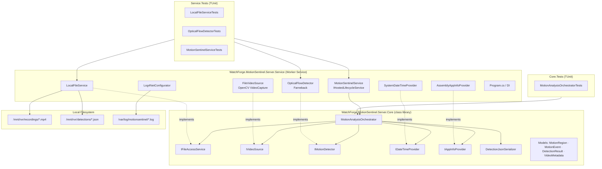
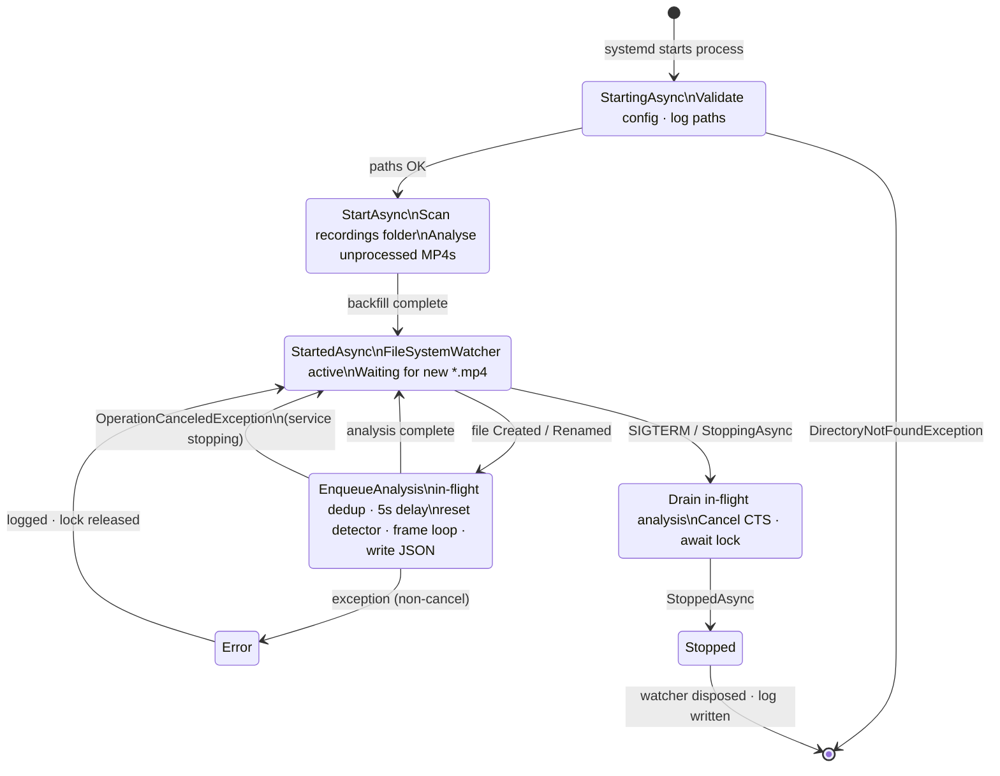
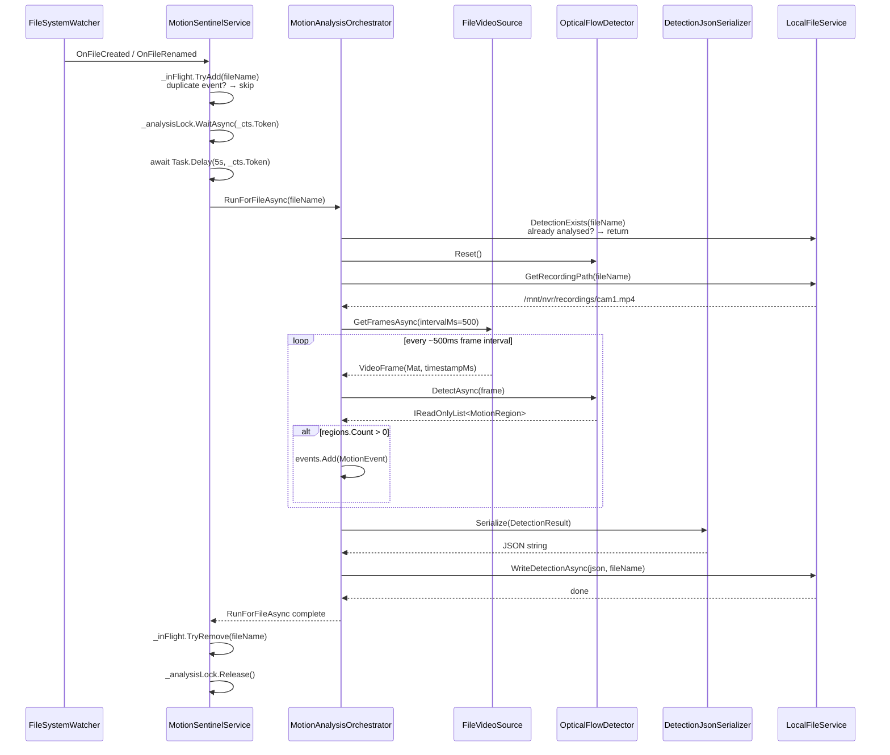

# WatchForge MotionSentinel

Headless Linux background service that watches a local NVR recordings folder, analyses new MP4 files using **OpenCV Farneback Dense Optical Flow**, and writes structured JSON detection results — all on the same machine where the NVR recordings are stored.

---

## Architecture

### Component diagram



### Worker lifecycle (state diagram)



### Analysis sequence (sequence diagram)



---

## Prerequisites

| Requirement | Notes |
|-------------|-------|
| **.NET 10 runtime** | `dotnet` on `PATH`; framework-dependent build |
| **OpenCvSharpExtern native bridge** | Shipped via NuGet: `OpenCvSharp4.official.runtime.linux-x64` — included in the Service csproj |

> The `OpenCvSharp4.official.runtime.linux-x64` package (built on `manylinux_2_28`) ships the
> pre-built `libOpenCvSharpExtern.so` and all required OpenCV shared libraries. No system OpenCV
> installation or manual build is needed — `dotnet restore` handles everything.

---

## How to build

```bash
# Run all tests (from repo root)
dotnet test --solution WatchForge.slnx

# Or run MotionSentinel tests only
dotnet test server/MotionSentinel/WatchForge.MotionSentinel.Server.Core.Tests/
dotnet test server/MotionSentinel/WatchForge.MotionSentinel.Server.Service.Tests/

# Publish framework-dependent (AnyCPU — runs on any Linux with .NET 10 runtime)
dotnet publish server/MotionSentinel/WatchForge.MotionSentinel.Server.Service/ \
  -c Release \
  -o ./publish
```

The output in `./publish/` is framework-dependent and runs on **Linux x64 distribution**
(CachyOS, Ubuntu, Debian, …) with .NET 10 runtime installed. No RID or
cross-compilation is required — build and deploy locally.

### Coverage report (optional)

```bash
# Collect coverage for all MotionSentinel test projects
dotnet-coverage collect \
  "dotnet test server/MotionSentinel/WatchForge.MotionSentinel.Server.Core.Tests/" \
  -f xml -o coverage-core.xml

dotnet-coverage collect \
  "dotnet test server/MotionSentinel/WatchForge.MotionSentinel.Server.Service.Tests/" \
  -f xml -o coverage-service.xml

# Generate HTML report
reportgenerator \
  -reports:"coverage-core.xml;coverage-service.xml" \
  -targetdir:"coverage-report" \
  -reporttypes:Html
```

---

## How to install

```bash
# 1. Create a dedicated system user (no login shell, no home dir)
sudo useradd --system --no-create-home --shell /usr/bin/nologin motionsentinel

# 2. Copy published output
sudo mkdir -p /opt/watchforge/motionsentinel
sudo cp -r ./publish/* /opt/watchforge/motionsentinel/
sudo chown -R motionsentinel:motionsentinel /opt/watchforge/motionsentinel

# 3. Install the systemd unit
sudo tee /etc/systemd/system/motionsentinel.service > /dev/null << 'EOF'
[Unit]
Description=WatchForge MotionSentinel
After=network-online.target
Wants=network-online.target

[Service]
Type=simple
User=motionsentinel
WorkingDirectory=/opt/watchforge/motionsentinel
ExecStart=/usr/bin/dotnet /opt/watchforge/motionsentinel/WatchForge.MotionSentinel.Server.Service.dll
Restart=on-failure
RestartSec=30
StandardOutput=null
StandardError=journal

[Install]
WantedBy=multi-user.target
EOF

# 4. Enable and start
sudo systemctl daemon-reload
sudo systemctl enable --now motionsentinel

# 5. Check status
sudo systemctl status motionsentinel
sudo journalctl -u motionsentinel -f
```

### Deploy update (same machine)

```bash
dotnet publish WatchForge.MotionSentinel.Server.Service/ -c Release -o ./publish
sudo cp -r ./publish/* /opt/watchforge/motionsentinel/
sudo systemctl restart motionsentinel
```

---

## How to configure

All paths and thresholds are set in `appsettings.json` — no hardcoded locations.

```json
{
  "LogDirectory": "/var/log/motionsentinel",

  "Files": {
    "RecordingsPath": "/mnt/nvr/recordings",
    "DetectionsPath": "/mnt/nvr/detections"
  },

  "Detection": {
    "IntensityThreshold": 0.05,
    "MinContourArea": 100.0
  }
}
```

| Key | Description |
|-----|-------------|
| `LogDirectory` | Folder for log4net rolling log files. Created automatically if absent. |
| `Files.RecordingsPath` | Absolute path to the folder where the NVR writes MP4 files. **Must exist** — service throws `DirectoryNotFoundException` on startup if missing. |
| `Files.DetectionsPath` | Absolute path where detection JSON files are written. Created automatically if absent. |
| `Detection.IntensityThreshold` | Optical flow magnitude threshold (0–1). Pixels with magnitude × 10 below this value are ignored. Default `0.05`. |
| `Detection.MinContourArea` | Minimum contour area in pixels for a region to be reported. Default `100.0`. |

### Log files

Log files roll every hour and are retained for 30 files (≈30 hours). Filename format:

```
HH-dd_MM_yyyy.log

16:34 on 17/03/2026  →  16-17_03_2026.log
17:00 on 17/03/2026  →  17-17_03_2026.log
```

### FileSystemWatcher delay

When a new MP4 is detected, analysis is delayed by **5 seconds** to allow the NVR to finish
writing the file before MotionSentinel reads it. This is a hardcoded safety margin; adjust
`Task.Delay(TimeSpan.FromSeconds(5))` in `MotionSentinelService.cs` if needed for your NVR.

### Tagging rule

If `<DetectionsPath>/<stem>.json` already exists for a given MP4, that file is **skipped**.
This is enforced at two levels:
- `MotionSentinelService` deduplicates events in-flight (`_inFlight` set) — prevents the same file from being queued twice simultaneously.
- `MotionAnalysisOrchestrator` checks `DetectionExists` before starting analysis — guards against race conditions and repeated watcher events that slip through.

---

## JSON output contract

```json
{
  "videoFile": "cam1_2024-01-15_08-00.mp4",
  "analyzedAt": "2024-01-15T10:32:00Z",
  "appVersion": "1.0.0",
  "metadata": {
    "durationMs": 900000,
    "width": 1920,
    "height": 1080,
    "frameRate": 25.0,
    "totalFramesAnalyzed": 1800
  },
  "events": [
    {
      "timestampMs": 4200,
      "durationMs": 500,
      "regions": [
        {
          "x": 0.2, "y": 0.1,
          "width": 0.3, "height": 0.4,
          "intensity": 0.78,
          "directionDx": 0.0,
          "directionDy": 0.0,
          "classification": null,
          "confidence": null
        }
      ]
    }
  ]
}
```

`classification` and `confidence` are reserved for future use and are always `null`.

---

*Part of [WatchForge](../../README.md) · `/server/MotionSentinel/` · .NET 10 · Linux · OpenCV · TUnit*
