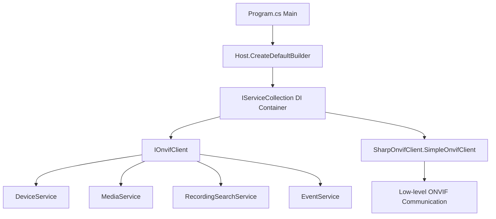

# WatchForge NVR Client

WatchForge NVR Client is a .NET 10 console application for connecting to ONVIF-compatible NVR devices and IP cameras.

## 🎯 Features

- **ONVIF Client** - Full ONVIF protocol support
- **SharpOnvif** - Uses actively maintained SharpOnvif library
- **SOLID Architecture** - Clean code with dependency injection
- **Cross-platform** - Windows, macOS, Linux (x64, ARM64)
- **100% Test Coverage** - Comprehensive unit tests with NUnit + TUnit

## 📁 Project Structure

```
testapps/nvr-client/
├── src/
│   ├── WatchForge.NVR.Client.Core/    # Core with ONVIF implementation
│   └── WatchForge.NVR.Client.TestApp/ # Console application
└── tests/
    └── WatchForge.NVR.Client.TestApp.Tests/  # Unit tests
```

Projects are managed from the root `WatchForge.slnx` solution file.

## 🛠️ Requirements

- .NET 10 SDK
- Windows, macOS, or Linux (x64, ARM64)

## 🚀 Quick Start

### 1. Install .NET 10

```bash
# Windows (winget)
winget install Microsoft.DotNet.SDK.10

# macOS (Homebrew)
brew install --cask dotnet-sdk

# Linux (Arch/CachyOS)
yay -S dotnet-sdk-10

# Or official installer
wget https://dot.net/v1/dotnet-install.sh
chmod +x dotnet-install.sh
./dotnet-install.sh --channel 10.0
```

### 2. Configuration

Edit `appsettings.json` in the `WatchForge.NVR.Client.TestApp` folder:

```json
{
  "Onvif": {
    "Host": "192.168.68.58",
    "Port": 80,
    "Username": "Cervenica110",
    "Password": "your_password",
    "ServicePath": "/onvif/device_service",
    "UseHttps": false,
    "TimeoutSeconds": 30
  }
}
```

### 3. Build

```bash
cd testapps/nvr-client

# Build for current platform
dotnet build

# Build for Raspberry Pi (ARM64)
dotnet publish -c Release -r linux-arm64 --self-contained

# Build for Linux x64
dotnet publish -c Release -r linux-x64 --self-contained

# Build for Windows x64
dotnet publish -c Release -r win-x64 --self-contained

# Build for macOS ARM64
dotnet publish -c Release -r osx-arm64 --self-contained
```

### 4. Run

```bash
# Debug build
dotnet run --project src/WatchForge.NVR.Client.TestApp

# Release build (after publishing)
# Linux/macOS
./src/WatchForge.NVR.Client.TestApp/bin/Release/net10.0/linux-x64/publish/WatchForge.NVR.Client.TestApp

# Windows
.\src\WatchForge.NVR.Client.TestApp\bin\Release\net10.0\win-x64\publish\WatchForge.NVR.Client.TestApp.exe
```

## 🧪 Testing

```bash
# Run all tests
dotnet test

# Run with code coverage
dotnet test /p:CollectCoverage=true

# Run with 100% threshold
dotnet test /p:CollectCoverage=true /p:Threshold=100
```

## 📦 Publishing as Single File

```bash
dotnet publish -c Release \
  -r linux-arm64 \
  --self-contained \
  /p:PublishSingleFile=true \
  /p:PublishTrimmed=true \
  /p:EnableCompressionInSingleFile=true
```

## 🔌 Environment Variables

Configuration can be overridden using environment variables (matching `appsettings.json` structure):

```bash
export Onvif__Host=192.168.68.58
export Onvif__Port=8080
export Onvif__Username=your_username
export Onvif__Password=your_password
```

Or in PowerShell (Windows):

```powershell
$env:Onvif__Host="192.168.68.58"
$env:Onvif__Port="8080"
$env:Onvif__Username="your_username"
$env:Onvif__Password="your_password"
```

## 📊 Architecture



## 📝 License

Part of the WatchForge project.
